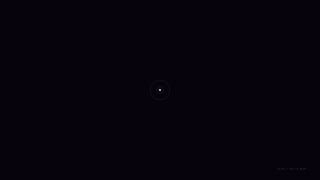

# Codex Startup Animation for Windows

给 Microsoft Store 版 Codex 添加约 12 秒的启动动画和应用内图片背景。支持更换头像、图片和文字，结尾以画面合拢过渡到 Codex。

基于 [panding999/codex-startup-animation](https://github.com/panding999/codex-startup-animation) 和 [paperfish-bot 的 Windows 分支](https://github.com/paperfish-bot/codex-startup-animation) 整理。这是非官方项目，官方应用需要另行安装。

## 动画演示



[观看或下载完整演示视频（720p / 60 帧）](https://github.com/yanami-sec/codex-startup-animation-windows/raw/refs/heads/main/docs/startup-demo.mp4)

演示使用公开版默认素材，展示完整开场与合拢结尾；不包含实际应用的加载等待，也不代表所有电脑的启动耗时。

## 安装

适用于 Windows 10/11、Windows PowerShell 5.1 和 Microsoft Store 版 `OpenAI.Codex`。需要该版本应用包含 Node.js 运行时；安装程序会检查。无需管理员权限，无需单独安装 Node.js 或 WebView2。

1. 点击 GitHub 的 **Code → Download ZIP**，解压到一个固定目录。
2. 在该目录打开 PowerShell，运行：

   ```powershell
   powershell.exe -NoProfile -ExecutionPolicy Bypass -File .\tools\install-windows.ps1
   ```

3. 从托盘完全退出 Codex，再点击桌面的 **Codex Animation**。

安装会在本机编译窗口控制程序，并创建两个桌面快捷方式。项目文件夹需要保留；移动后请重新运行安装脚本。启动入口通过隐藏脚本运行，不会弹出终端或准备提示框。

## 更换图片与文字

启动后点击桌面的 **Codex Image Settings**，或在 Codex 主窗口按 **Ctrl+Alt+B**。可更换头像、背景、标题和字幕，调节背景强度。设置保存在本机应用页面的 IndexedDB 中，不会上传到 GitHub。

双击 `index.html` 可在浏览器预览动画；浏览器预览设置与应用内设置分别保存。公开版附带由 `assets/demo-avatar.svg` 和 `assets/demo-artwork.svg` 生成的示例素材。

## 启动与背景

- 图片解码和动画预热期间保持隐藏，准备好才播放。
- 检测到桌宠就绪后缓冲 3 秒；桌宠不可用时有等待上限。
- 动画先开始运行，再显示主窗口，减少首帧停顿和闪屏。
- 背景属于 Codex 页面，随窗口缩放，不会残留在桌面右半边。
- 主窗口与设置页沿用现有 Codex 用户数据，不替换官方安装包。

首次启动总时间包含 Codex 本身的加载和约 12 秒动画，无法保证所有机器都同样快。此版本在一台 Windows 11 机器上实际验证过冷启动，另有页面预热和计时回归测试；其他硬件及应用版本仍需反馈。当前不提供视频背景。

## 常见问题

**直接点官方图标没有动画：** 使用本项目创建的 **Codex Animation** 入口。

**提示应用正在运行：** 从托盘完全退出 Codex 后，再用动画入口打开。已运行且未开放本地接口的窗口不能直接接入。

**官方应用更新后不能启动：** 重新运行安装脚本检查运行时。应用结构或样式改变可能需要更新本项目。

**想停用：** 完全退出 Codex，之后使用官方入口打开。删除本项目的两个快捷方式即可停止使用。安装不创建开机任务或登录监听。

启动状态及错误记录位于 `%LOCALAPPDATA%\OpenAI\ChatGPTFix`。如反馈问题，请只提供启动错误和耗时，不上传账号配置或聊天数据。

## 本地接口与代理

启动器启用 `127.0.0.1:19341` 的本地调试接口，用于临时载入页面动画与背景，并检查端口所属的官方应用进程。只用于本机，不要转发或对外开放；退出应用后接口关闭。

如本机已有 `~/.codex/.env`，启动器只读取代理相关变量并传给子进程，不创建或改写代理配置。仓库不包含个人代理地址、令牌、聊天数据和个人图片。

## 开发与验证

普通使用不需要 npm。开发测试需要 Node.js 22 或更新版本：

```powershell
npm install
npm test
npx playwright install chromium
npm run test:browser
powershell.exe -NoProfile -ExecutionPolicy Bypass -File .\tools\build-startup-gate.ps1
```

## 来源与许可

保留上游作者来源。本项目未取得将上游代码重新授权为 MIT 等许可证的依据，因此不添加此类许可证。公开仓库不代表对上游代码或第三方商标授予额外权利。详见 [第三方说明](THIRD_PARTY_NOTICES.md)。
